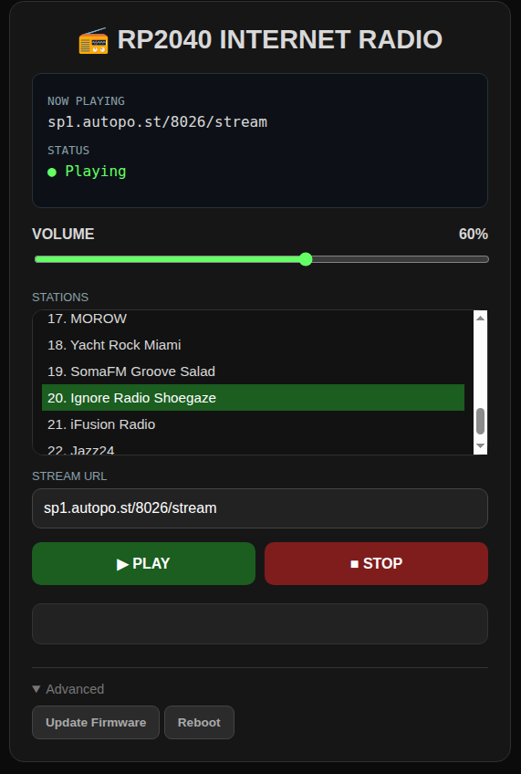

# Pico-Ethernet-Radio

<figure>
    
    <figcaption><i>Web interface view</i></figcaption>
</figure>

 
 

Simple internet radio player based on RP2040, ENC28J60 Ethernet controller and I2S audio DAC (tested with PCM5100A).

The project started as an experiment to see whether a Raspberry Pi Pico could decode and play MP3 radio streams in real time while handling networking through lwIP.
What began as a quick proof-of-concept eventually grew into a usable radio featuring a web-based control interface, SMP FreeRTOS application, and firmware-over-the-air updates.

## Functionalities

* Real-time internet radio playback on RP2040 (clocked at 150MHz for smooth operation)
* Support for MP3 streams over HTTP
* Ethernet networking via ENC28J60 controller
* FreeRTOS SMP application utilizing both RP2040 cores
* Fixed-point audio decoding using Helix MP3 Decoder with streaming-related modifications
* Compatible with PCM5100A and other I2S DACs
* Embedded HTTP server for device control
* Single-page web interface served directly from firmware
* Playback control (start/stop)
* Runtime volume adjustment
* Predefined radio station list
* Support for custom stream URLs
* Firmware-over-the-air (FOTA) updates through the web interface
* Dual-slot firmware update mechanism
* Custom bootloader responsible for booting and update process
* UART debug logging for development and troubleshooting

## Hardware

Tested hardware:

* Raspberry Pi Pico board
* ENC28J60 Ethernet module
* PCM5100A I2S DAC

The project should work with other RP2040-compatible boards and I2S DACs.

## Software stack

### Application firmware

* [Pico SDK](https://github.com/raspberrypi/pico-sdk)
* [FreeRTOS](https://github.com/FreeRTOS/FreeRTOS-Kernel)
* [lwIP](https://github.com/lwip-tcpip/lwip)
* [Helix MP3 Decoder](https://github.com/Lefucjusz/Helix-MP3-Decoder) (with streaming-related modifications)

### Bootloader

* Bare-metal Pico SDK application

## Motivation

The idea for this project started when my friend [@SP2FET](https://github.com/SP2FET) recently got me back into listening to the radio and introduced me to _Off Control_, a music program broadcast by Polish Radio Trójka.

I used to listen to the radio quite frequently during my university years, mostly on a small radio receiver I had built myself around an AT89S52 microcontroller and an RDA5807 FM tuner. Over time that habit slowly faded away, and the device eventually ended up forgotten in a drawer along with many other old projects. Discovering _Off Control_ unexpectedly brought that interest back and made me think that building a dedicated internet radio could be a fun project.

As with most of my projects, the main trigger was simple curiosity. The original goal was to answer a fairly straightforward question:

_Can RP2040 decode an MP3 internet radio stream in real time while handling all networking tasks itself?_

I also wanted an excuse to finally use lwIP in a real project. Despite working with embedded systems for some time, I never had a chance to build anything with it.

Another motivation was purely practical. Over the years I have accumulated a rather unhealthy number of RP2040/RP2350 boards, along with an ENC28J60 Ethernet module borrowed from a friend back at university sometime in late 2021. The module has been used **exactly once** since then, shortly after borrowing it, which made it difficult to justify its continued absence from its rightful owner. Building an internet radio seemed like a reasonable way to improve that statistic.

The project was initially extremely simple and put together over a few evenings (and I was fully convinced it would stay that way forever). The first version contained a single hardcoded radio station, no error handling, no restart logic in case of network glitch, and no user interface whatsoever. Once streaming worked reliably, I started adding features one by one:

* "Some kind of interface would be useful. Maybe just a field for pasting a stream URL."
* "Maybe I should make a web interface? I've never written an HTTP server before."
* "I've already memorized the IP addresses of my favourite stations. Maybe a station list would be more convenient."
* "Maybe I should add FOTA updates so I don't have to move this pile of wires every time I fix a bug."

And that's how a proof-of-concept gradually became a somewhat usable device.

## Web interface

The radio is controlled through a built-in HTTP server that, I admit, is partially vibe-coded. I've never been a frontend guy.

The web interface allows:

* selecting predefined radio stations;
* entering custom stream URLs;
* starting and stopping playback;
* adjusting volume;
* uploading firmware updates;
* rebooting the device;
* monitoring playback status.

The entire webpage is embedded directly into the firmware image and served from device memory.

## Firmware update mechanism

The device supports firmware updates directly through the web interface, allowing upgrades without physical access or a USB connection.

Firmware images are uploaded into a staging slot located in flash memory. During boot, the custom bootloader validates the staged image and, if valid, activates it. Otherwise, the currently active firmware remains unchanged.

A more detailed description of the flash layout and boot process will be added in a future update. For now, it is worth mentioning that the firmware uses an `active/staging` layout rather than a traditional `A/B` scheme.

This simplifies the implementation because the application is always executed from the same flash address. With a true A/B design, the firmware would either need to be linked for multiple execution addresses or built as a genuinely position-independent binary. For a hobby project, that additional complexity did not seem worth the effort.

## Current status

This project should be considered a hobby project and a proof-of-concept rather than a production-ready internet radio.

The primary goals were:

* exploring lwIP integration with ENC28J60;
* testing real-time MP3 streaming on RP2040;
* implementing a simple HTTP server;
* experimenting with firmware-over-the-air updates via HTTP.

The fact that it eventually turned into a radio that I've been using daily for more than a week was mostly a side effect.

## Watch your mutexes
You would probably expect the hardest part of this project to be the custom bootloader, flash write operations, firmware update mechanism, or getting real-time MP3 decoding to run on an RP2040.

It was none of those. Not even close.

The actual winner was what turned out to be a missing mutex acquisition in `enc28j60_get_irq_flags()` inside my ENC28J60 driver.

The ENC28J60 is not exactly the easiest chip to debug. It has a fairly long list of errata, I wrote the driver myself, and the whole thing was connected through a breadboard setup. I spent around three days debugging completely random and intermittent SPI communication corruption. Sometimes the device could not get past IP acquisition. Sometimes it worked flawlessly for an hour. I had no idea whether I was dealing with a hardware problem, a faulty module, signal integrity issues, a driver bug, or one of the many possible ENC28J60 quirks.

I changed wiring, reduced SPI clock speed, checked SPI signals shape with an oscilloscope and went through multiple possible explanations.

After a lot of debugging, the cause turned out to be a single missing mutex acquisition. Two contexts were accessing the ENC28J60 SPI interface without proper synchronization, occasionally corrupting communication.

One missing mutex. Three days of debugging.

## Known limitations and issues

### Documentation status
The project is currently poorly documented. I plan to gradually extend this README with more detailed information about:

* flash layout;
* overall radio application architecture;
* event/state machine design;
* firmware update mechanism;
* provisioning image concept.

Unfortunately, I haven't had much time recently and that doesn't seem likely to change soon, so the current goal is simply to document everything before I forget how it works :smile:

### Decoder startup lockup
Occasionally the device gets stuck in the decoder startup state. The issue is difficult to reproduce; the entire board becomes unresponsive and UART logs do not show anything suspicious before the lockup occurs.

At some point I need to catch this under a debugger and investigate what is actually happening there.

The current decoder error recovery strategy is not very elegant in general. It reinitializes the entire Helix decoder instance, including freeing and allocating back relatively large memory blocks. This approach is quite expensive, but it is a leftover from an earlier stage of the project where it was "good enough" and has remained because it worked reliably enough in practice.

### FOTA implementation coupling
The FOTA mechanism is currently tightly coupled with the HTTP server implementation. Ideally, these components would be separated behind a cleaner abstraction layer.

The reason for this implementation choice is the way RP2040 flash programming works: while writing to flash, code cannot be executed from flash memory. This makes firmware updates more complicated because the update code has to run from RAM during the actual write operation, the second core needs to be prevented from accessing flash, interrupts need to be disabled, etc.

For now, this was the simplest solution and it works.

### No ICY metadata support
The stream client currently does not handle ICY metadata, meaning the radio cannot display information about the currently playing song.

Adding this would be a nice improvement in the future. Discovering new music has always been one of my favourite parts of listening to the radio, and displaying the currently playing track would make the device feel much more like a proper radio receiver.
